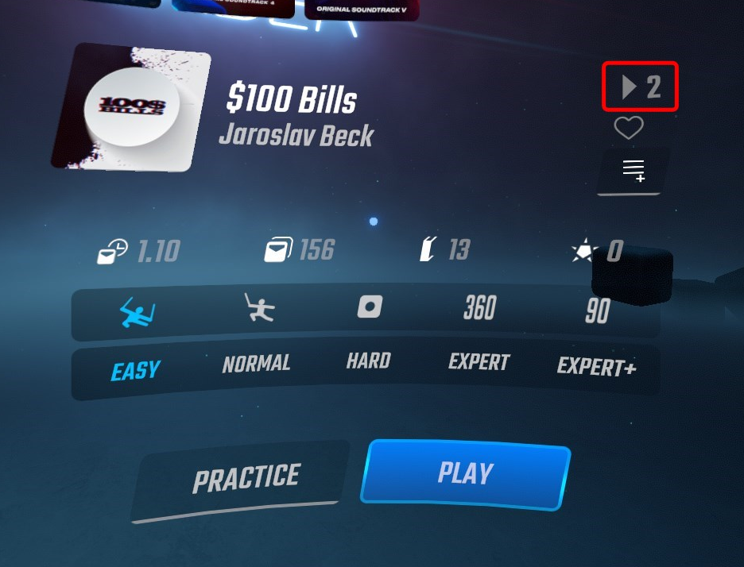
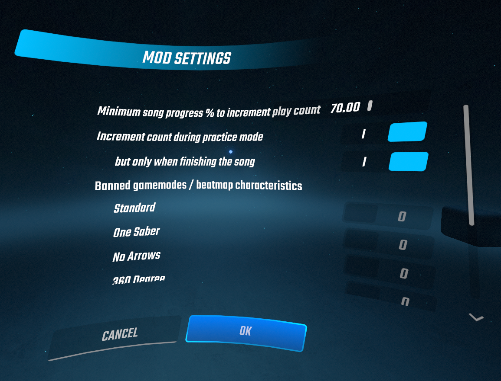

# Simple Beatmap Play Count

Simple mod to keep track of how many times you've played a song.

By default, the count is incremented after reaching 70% through the song, though this value is configurable:

### Data location

Play counts are stored in `(Game directory)\UserData\PlayCounts\(Level ID).count`.