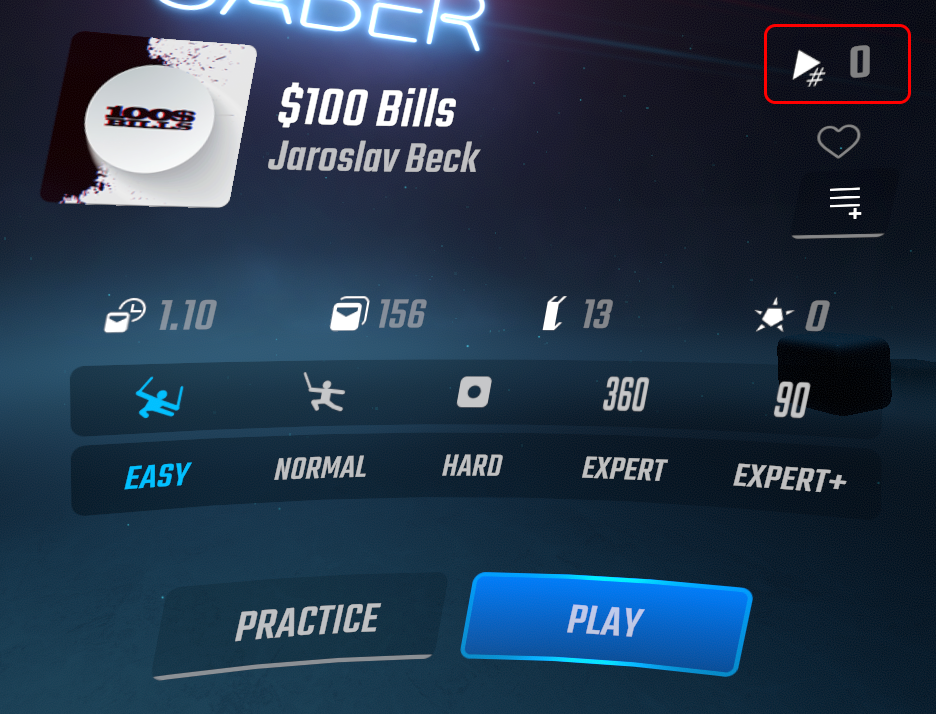

# Simple Beatmap Play Count

Simple mod to keep track of how many times you've played a song.

By default, the count is incremented after reaching 70% through the song, though this value, and many more, are configurable:

### TODO

- Enable during multiplayer
- Add "Unplayed" and "Played" filters to song select
- Add sorting by play count to song select

## Installation

1. Make sure your Beat Saber installation [has mod support](https://bsmg.wiki/pc-modding.html) (e.g. setup via ModAssistant)
1. Download the latest release for your Beat Saber version from [the Releases link on the right](releases/).
1. Drop the downloaded .dll into the `(Game directory)\Plugins` directory

## Data location

Play counts are stored in `(Game directory)\UserData\PlayCounts\(Level ID).count`.

### TODO

- Enable during multiplayer
- Add "Unplayed" and "Played" filters to song select
- Add sorting by play count to song select